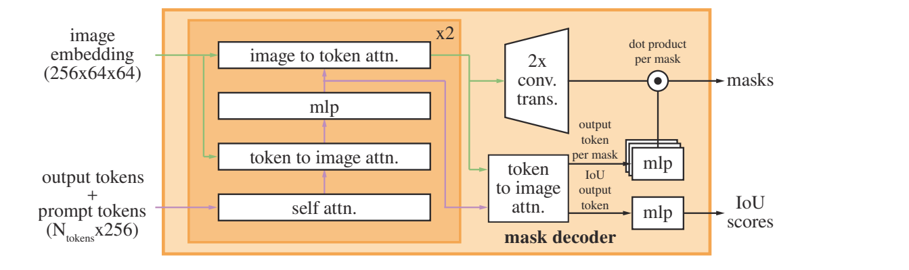

# 3.Effective conditioned and composed image retrieval combining CLIP-based features

## 0.abstract

Conditioned and composed image  条件化和合成图像

CBIR systems (Content-based image retrieval)

## 1.introduce

Relevance feedback（相关性反馈）

用户可以描述所需结果必须满足的条件，除了查询图像的视觉特征之外。这定义了条件图像检索的任务

所提出的系统基于一个网络，该网络结合了从OpenAI CLIP网络中提取的视觉和文本特征。

标准数据集FashionIQ \[40]（用于时尚领域）和CIRR \[27]（用于更一般的内容）

## 2.Related works

### 2.1Visual and language pretraining

**CLIP** \[29]最近在多模式零样本学习（in multi-modal zero shot learning）方面取得了显著的成果，展示了图像和文本的特征泛化能力。

但它已经成功应用于细粒度艺术分类（like fine-grained art classification）、图像生成（image generation）、零样本视频检索（zero shot video re- trieval）、事件分类（event classification）和视觉常识推理（visual common- sense reasoning）等不同任务。

**ALIGN** \[17]采用了双编码器架构，利用对比蒸馏，实现了更加高效的数据处理过程

### 2.2 Conditioned and combined image retrieval

介绍第一个任务的现有解决方法 （ser）

## 3.The proposed method

文本和图像中表达的相似概念往往共享相似的特征，或者至少在共同的空间中是“接近”的。

**跨模态对比损失（Contrastive Loss）**：它的目标是将相似的样本在嵌入空间中映射到相邻的位置，而将不相似的样本映射到较远的位置。在跨模态场景中，通常会使用两种不同的嵌入表示（如图像和文本），并希望这些嵌入能够在共享的特征空间中对齐。

<figure><figcaption></figcaption></figure>

The Combiner function（组合器函数）：在条件和组合图像检索方面达到了新的最先进性能

我们采用了基于批次的分类（Batch-based Classification，BBC）损失函数

<figure><figcaption></figcaption></figure>

### 3.1. Preprocess Pipeline

CLIP的标准预处理流程主要由两个步骤组成：首先进行调整大小操作，其中图像的较小边与CLIP输入维度input dim匹配，然后进行中心裁剪操作，结果是一个尺寸为input dim×input dim的正方形图像补丁。随后，随着较大边和较小边之间的比率增加，预处理后图像的丢失区域也增加。

为了解决信息丢失的问题，最简单的方法是进行零填充，使较小边与较大边匹配（即将图像变为正方形）。通过这样做，我们将归因于中心裁剪操作的内容信息损失归零，但是我们降低了图像有用部分的分辨率，因为CLIP图像编码器的输入维度是固定的。因此，与我们先前的工作\[3]不同，我们提出了一种新的预处理流程，旨在在上述流程之间找到一个折中方案：在应用中心裁剪操作之前，仅在图像的纵横比超过固定目标比率时进行填充。此外，当我们进行图像填充时，我们不将其变为正方形，而是使其纵横比接近目标比率。

### 3.2. Implementation Details

CLIP编码器被保持冻结，模型中唯一训练的部分是组合器函数。

预处理流程中的目标比率需要设置

## 4.The proposed demo

### 4.1. Architecture

web端

### 4.2. Implementation details

数据集细分为三个类别（连衣裙、上衣和 衬衫）

### 4.3. Usage and Examples

## 5.Experimental results

two standard datasets, FashionIQ and CIRR.

### 5.1. FashionIQ

### 5.2. CIRR

(Compose Image Retrieval on Real-life im- ages)

数据集旨在克服有条件图像检索数据集（如FashionIQ）中出现的两个常见问题：受限的图像领域导致视觉复杂性不足以及许多假阴性样本存在，因为目标图像无法为每个（参考，文本）对进行广泛标注。、

RecallSubset：它不受假阴性样本的影响，并且由于具有高视觉相似性的负样本，它可以捕捉到细粒度的图像-文本修改。

### 5.3. Comparison with SotA

## 6.Conclusions

在这篇论文中，我们利用了最近的CLIP模型来解决有条件的图像检索问题，利用了它的零-shot迁移特性。通过针对检索任务使用CLIP的新型预处理流程，我们开发了一个能够计算由参考图像和文本描述组成的组合特征的组合器网络。此外，我们提出了一种预处理填充方法，可以提高在具有许多不同宽高比图像的数据集中的性能。我们在具有挑战性的时尚数据集FashionIQ和最近提出的CIRR数据集上进行了实验。两个数据集上的实验结果表明，我们的方法能够显著超越更复杂的现有方法。

演示系统允许用户使用这两个数据集的图像-文本对来测试所提出的方法，或者让用户提供自己的文本，模拟系统在实际部署中的行为。界面允许实现基于回合的交互，模拟用户在电子商务网站上的行为。该系统可以在相对性能较低的服务器上使用，并且可以使用标准CBIR系统中常用的技术来扩展到大规模数据集。


