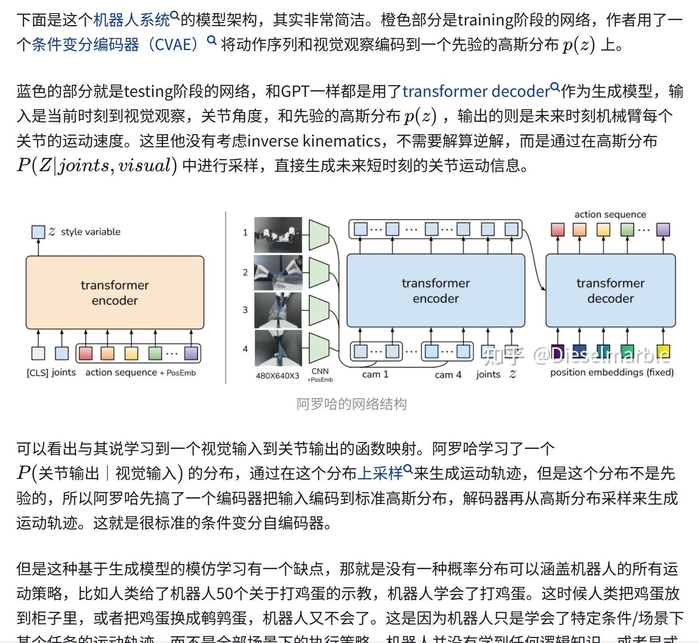

# Ladder Fine-tuning approach for SAM integrating complementary network

## [https://arxiv.org/pdf/2306.12737.pdf](https://arxiv.org/pdf/2306.12737.pdf)

## git:[https://github.com/11yxk/SAM-LST](https://github.com/11yxk/SAM-LST)

## data :[https://github.com/hitachinsk/SAMed](https://github.com/hitachinsk/SAMed)

## Segment Anything Model (SAM)（图像分割）医学图像与CNN结合

## 运用的模型：

**全卷积网络（FCN）：**这种方法能够处理任意大小的输入图像，并通过用卷积层替换全连接层来生成分割结果。（对标于CNN）

**U-Net：**是最常用的医学图像分割架构。它包括一个编码器和一个解码器，它们之间有跳跃连接以保留重要的特征。

**Transformer**：在计算机视觉领域引入了（与传统的CNN架构相比，Transformer可以捕捉更长范围的依赖关系。）

**ViT：**图像分类，采用了自注意机制 。。。。。等等

Deeplab 、

难点：lack of training samples due to privacy concerns

sloution： ensure their optimal utilization(~~这也叫答案？~~)

data set:various medical imaging modality such as X-rays, CT scans, MRI scans, or ultrasound images

### SAM

include:image encoder, prompt encoder and mask decoder

#### mask decoder

掩码解码器：掩码解码器是一个生成模型的组件，用于生成目标图像或以图像为基础进行图像编辑的掩码。它接收图像编码器和提示编码器的输出，并生成一个掩码，指示生成图像中的目标对象或要编辑的区域。掩码解码器可以是一个生成对抗网络（GAN）或变分自动编码器（VAE），它使用编码器的输出来生成与输入提示相关的图像。

## Ladder-Side Tuning with SAM：

aim：avoiding the backpropagation through entire SAM model

我们只更新SAM解码器和集成CNN网络的参数，以在医学数据集上微调SAM模型。

设计遵循ResNet18 \[18]，包括跳跃连接。然而，为了生成与SAM编码器相同大小的特征图，该网络经过修改，只使用了13层而不是全部18层（ResNet18包含18个卷积层）。

我们提议在组合这两个提取的特征图时加入可学习的门控（权重参数）α：

x = α · xsam + (1 − α) · xcnn

用随机旋转和翻转操作随机数据增强

## Ablation study 消融实验

<figure><figcaption></figcaption></figure>

[对比实验系数](https://blog.csdn.net/qq\_37652891/article/details/123473086?ops\_request\_misc=%257B%2522request%255Fid%2522%253A%2522169806241816800215078243%2522%252C%2522scm%2522%253A%252220140713.130102334..%2522%257D\&request\_id=169806241816800215078243\&biz\_id=0\&utm\_medium=distribute.pc\_search\_result.none-task-blog-2\~all\~sobaiduend\~default-2-123473086-null-null.142^v96^pc\_search\_result\_base6\&utm\_term=DSC%20HD95\&spm=1018.2226.3001.4187)（[DSC](https://so.csdn.net/so/search?q=DSC\&spm=1001.2101.3001.7020)和HD医学图像分割评价指标）

#### [图像分割评](https://blog.csdn.net/kksimida/article/details/129643885?ops\_request\_misc=%257B%2522request%255Fid%2522%253A%2522169805899316800188527608%2522%252C%2522scm%2522%253A%252220140713.130102334..%2522%257D\&request\_id=169805899316800188527608\&biz\_id=0\&utm\_medium=distribute.pc\_search\_result.none-task-blog-2\~all\~top\_click\~default-2-129643885-null-null.142^v96^pc\_search\_result\_base6\&utm\_term=dice\&spm=1018.2226.3001.4187)价指标: [Dice](https://blog.csdn.net/m0\_57527312/article/details/124202172?ops\_request\_misc=%257B%2522request%255Fid%2522%253A%2522169805899316800188527608%2522%252C%2522scm%2522%253A%252220140713.130102334..%2522%257D\&request\_id=169805899316800188527608\&biz\_id=0\&utm\_medium=distribute.pc\_search\_result.none-task-blog-2\~all\~top\_positive\~default-1-124202172-null-null.142^v96^pc\_search\_result\_base6\&utm\_term=dice\&spm=1018.2226.3001.4187) 

<figure><figcaption></figcaption></figure>

我们把X当作Gt，Y当作Pred，dice系数就可以评价结果了。

参考上面的韦恩图：

&#x20;       X = FN + TP

&#x20;       Y = TP + FP

所以，上面公式可以转换为：

<figure><figcaption></figcaption></figure>




